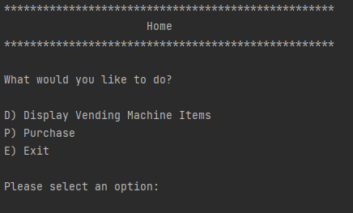
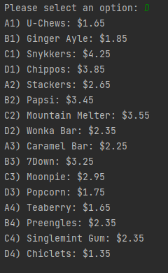
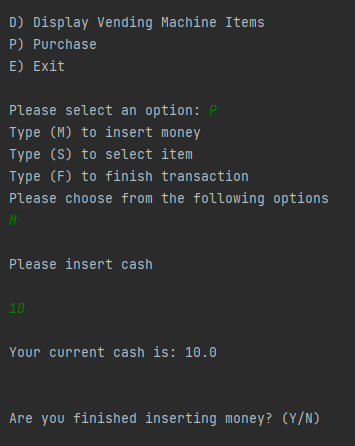
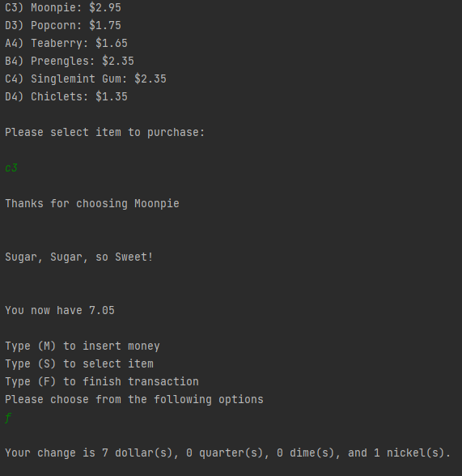

# Vending Machine Application OOP Capstone

Vending Machine: Developed a command line vending machine application. Uses file I/O and includes delimited input file processing. Displays and stores the vending machine's inventory. Updates the inventory as purchases are made. Allows the user to deposit money (one bill at a time), tracks the users balance as purchases are made, and returns the correct change to the user upon completion of purchases. Includes an auto generated sales report (Log.txt) which includes money deposited, purchases made and funds returned to the customer. Includes JUnit testing to verify the methods used.

## Main Menu

## Display Inventory

## Insert Cash

## Complete Purchase
